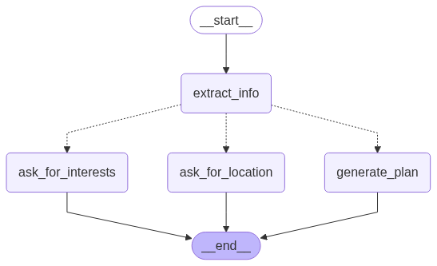

# LLM Trip Planner Agent

This project is a conversational AI agent that helps users plan personalized trips. Built with LangGraph and Gradio, the agent intelligently gathers necessary information like the user's desired destination and interests before generating a customized travel itinerary.

## Features

- **Conversational UI:** An intuitive chat interface powered by Gradio for seamless user interaction.
- **Stateful Conversations:** The agent remembers the context of the conversation, such as the user's specified location and interests, across multiple turns.
- **Intelligent Information Extraction:** The agent can parse user messages to find key details, even if they are provided in separate messages.
- **Personalized Plan Generation:** Once all required information is gathered, the agent uses an LLM to create a travel plan tailored to the user's needs.

## How It Works

The application consists of a Gradio front-end and a LangGraph-powered back-end. LangGraph orchestrates the flow of the conversation, managing the agent's state and deciding which action to take next.

The core logic is defined in a state graph, which visualizes the flow of the agent's decision-making process.

### Agent Graph



The graph consists of the following key nodes:

- **`extract_info`**: This is the entry point of the graph. It analyzes the user's messages to extract the `location` and `interests`.
- **`router`**: After the `extract_info` node, a conditional router checks the current state:
    - If a `location` is missing, it routes the conversation to the `ask_for_location` node.
    - If the `location` is present but `interests` are missing, it routes to the `ask_for_interests` node.
    - If both `location` and `interests` are present, it routes to the `generate_plan` node.
- **`ask_for_location`**: If the destination is unknown, this node generates a message asking the user to provide one.
- **`ask_for_interests`**: If the user's interests are unknown, this node generates a message asking the user to describe them.
- **`generate_plan`**: Once all necessary information has been collected, this node calls the LLM to create a personalized travel plan.

## Setup and Installation

1.  **Clone the repository**
    ```bash
    git clone https://github.com/trgiangdo/travel_planner.git
    cd travel_planner
    ```

2.  **Create and install the dependencies**
    This project uses `uv` for package management.
    ```bash
    uv venv
    uv sync
    ```

3.  **Set up environment variables:**
    Create a `.env` file by copying the example and add your OpenAI API key.
    ```bash
    cp .env_example .env
    ```
    Now, edit the `.env` file to add your credentials.

## Usage

To run the application, use the following command:

```bash
uv run gradio app.py
```

This will start the Gradio server with hot-reloading. You can access the chat interface by opening the provided URL in your web browser.
